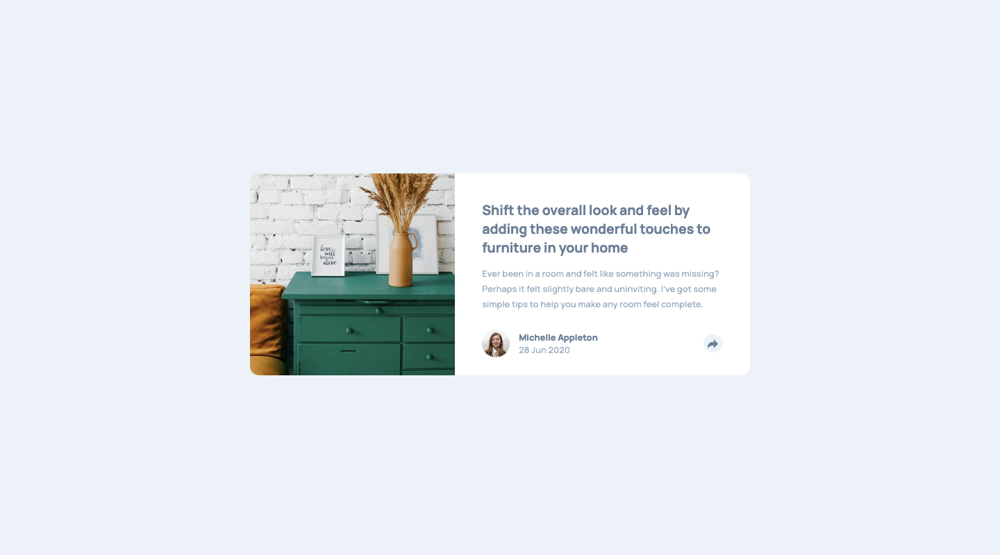
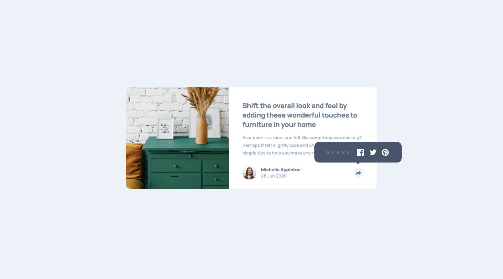
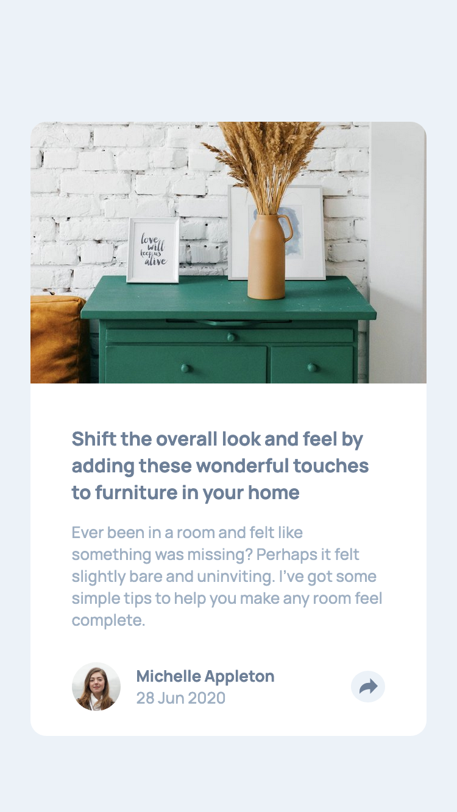
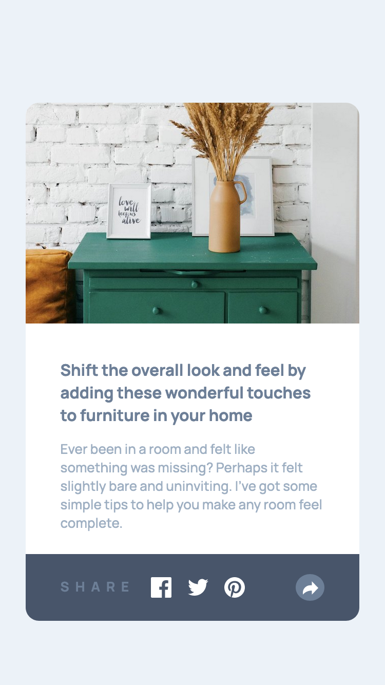

# Frontend Mentor - Article preview component solution

This is a solution to the [Article preview component challenge on Frontend Mentor](https://www.frontendmentor.io/challenges/article-preview-component-dYBN_pYFT). Frontend Mentor challenges help you improve your coding skills by building realistic projects.

## Table of contents

- [Overview](#overview)
  - [The challenge](#the-challenge)
  - [Screenshot](#screenshot)
  - [Links](#links)
- [My process](#my-process)
  - [Built with](#built-with)
  - [What I learned](#what-i-learned)
  - [Useful resources](#useful-resources)
- [Author](#author)
- [Acknowledgments](#acknowledgments)

## Overview

### The challenge

Users should be able to:

- View the optimal layout for the component depending on their device's screen size
- See the social media share links when they click the share icon

### Screenshot

### Links

- [Solution URL here](https://ckrdi.github.io/article-preview-component/)

## My process

### Built with

- Semantic HTML5 markup
- Sass
- Flexbox
- CSS Grid
- Mobile-first workflow

### What I learned

I learn about relative positioning and absolute positioning.

### Useful resources

- [Absolute, Relative, Fixed Positioning: How Do They Differ?](https://css-tricks.com/absolute-relative-fixed-positioining-how-do-they-differ/) - This helped me for understanding position in HTML.
- [Absolute Positioning Inside Relative Positioning](https://css-tricks.com/absolute-positioning-inside-relative-positioning/) - This is an amazing article which helped me finally understand parent-child relationship in positioning. I'd recommend it to anyone still learning this concept.

## Author

- Frontend Mentor - [@ckrdi](https://www.frontendmentor.io/profile/ckrdi)
- Twitter - [@ckrdi](https://www.twitter.com/ckrdi)

## Acknowledgments

Thank you to @AgataLiberska for pointing out relative and absolute positioning, and
@akash-1712 for making my design more responsive.
